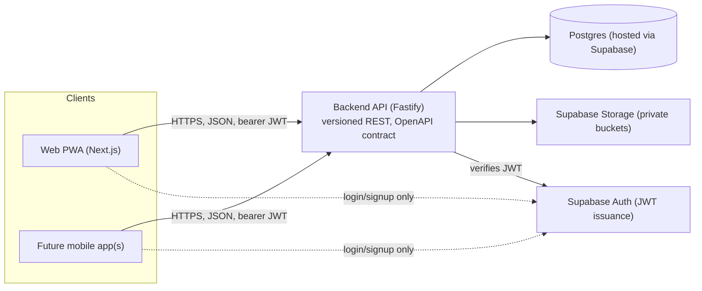

# Architecture

See [`CLAUDE.md`](../CLAUDE.md) for the tech stack summary and repo map. This doc
covers how the pieces fit together and, just as importantly, what each piece must
never do.

## System view

## Responsibilities and boundaries

**Clients (Web PWA today; mobile, later)**
- Own presentation and interaction only. No business logic, no direct database or
  storage access.
- Talk to Supabase Auth directly *only* for login/signup/token refresh — every other
  interaction goes through the backend API.
- Must never hold a Supabase service-role key or talk to Postgres/Storage directly.

**Backend API (Fastify)**
- The only thing that talks to Postgres and Supabase Storage.
- Owns all business logic: validation, per-user authorization, reminders, category
  rules, etc.
- Verifies the JWT issued by Supabase Auth on every request; enforces per-user data
  scoping in application code (not just relying on DB-level RLS — see
  [`decisions/0003-multiuser-from-day-one.md`](decisions/0003-multiuser-from-day-one.md)).
- Exposes a versioned REST contract (`/api/v1/...`) described by an OpenAPI spec, so
  any client (web, Android, iOS) can be built against that one file instead of
  reading backend source.

**Postgres (via Supabase)**
- Source of truth for structured data. RLS enabled as defense-in-depth, but the
  backend is the primary trust boundary, not the database.

**Supabase Storage**
- Holds file attachments (private buckets only). Accessed exclusively through the
  backend, which issues short-lived signed URLs when a client needs to read a file.

**Supabase Auth**
- Identity provider only: signup, login, password reset, JWT issuance. It does not
  hold any domain data (documents, money, etc.) — that all lives in our own Postgres
  tables, owned by the backend.

## Why decoupled

The explicit goal is to make future clients (Android/iOS) "plug and play": they
implement the OpenAPI contract and reuse `packages/shared` validation types, without
needing to know Supabase exists. See
[`decisions/0001-decoupled-monorepo-architecture.md`](decisions/0001-decoupled-monorepo-architecture.md).
